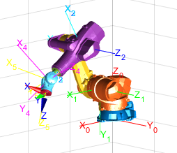
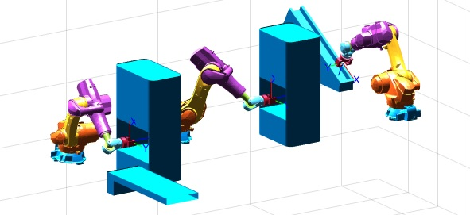

Este repositorio presenta un ejemplo de análisis cinemático y planificación de trayectorias para robots industriales manipuladores de 6 grados de libertad, desarrollado utilizando MATLAB, el Toolbox de Robótica de Peter Corke y funciones implementadas específicamente para el proyecto.

---

# Análisis cinemático de un robot industrial serie de 6 grados de libertad

Este proyecto académico tuvo como objetivo proponer una aplicación industrial y evaluar su viabilidad mediante el uso de robots manipuladores industriales. Para ello, se realizó un estudio de:

* Cinemática directa.
* Cinemática inversa.
* Relación entre velocidades articulares y cartesianas mediante el Jacobiano.
* Detección y análisis de singularidades.
* Planificación y generación de trayectorias.

Como caso de estudio, se planteó la implementación de tres robots industriales KUKA KR 120 R2100 nano F exclusive en una línea de producción destinada a la manipulación de piezas de fundición.

El proyecto fue desarrollado como parte de la asignatura Robótica de la Universidad Nacional de Cuyo. Aunque fue realizado durante mis estudios universitarios hace algunos años, decidí publicarlo como muestra de mi formación y experiencia en robótica industrial.

En este repositorio se incluyen:

* El informe completo del proyecto (en español).
* Las simulaciones realizadas en MATLAB.
* Las animaciones correspondientes al movimiento de cada robot.

---

## 🛰️ Contacto

Si tienes preguntas, sugerencias o deseas colaborar, no dudes en ponerte en contacto:

**Tomás Suárez**
Ingeniero Mecatrónico
📧 [suareztomasm@gmail.com](mailto:suareztomasm@gmail.com)
